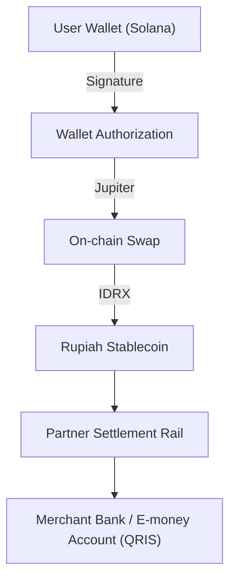
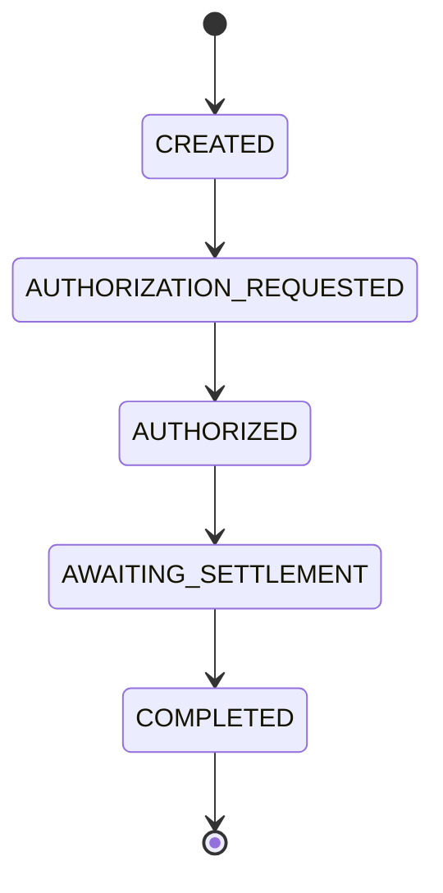

  

  

# SOLQ — Non-Custodial Solana Payment Orchestrator

SOLQ is a consumer-side, non-custodial payment orchestrator designed to bridge Solana-based digital assets with Indonesia’s national QRIS payment rails.

It enables users to initiate authorized on-chain transactions for real-world merchant payments — without merchant-side infrastructure changes and without asset custody.

---

## Overview

SOLQ focuses on infrastructure correctness, deterministic settlement flow, and regulatory-aligned orchestration.

The system is engineered to:

- Orchestrate user-authorized on-chain payment intents
- Interact with public blockchain state only
- Delegate fiat settlement to regulated financial infrastructure partners
- Maintain strict non-custodial boundaries

SOLQ does **not** hold, transmit, or store user funds.

---

## 🏗 High-Level Architecture

SOLQ acts purely as an **orchestrator** between these high-performance institutional components.

---

## 🔄 Payment Lifecycle

1. **Authorization**: User initiates intent via a supported Solana wallet.
2. **On-Chain Execution**: Decentralized swap protocols execute asset conversion to stable assets.
3. **Settlement Logic**: Orchestrated routing to designated settlement endpoints.
4. **Finalization**: Multi-oracle verification of transaction finality on the Solana mainnet.

---

## 🔒 Transaction State Machine

SOLQ enforces a strict, linear state machine to ensure auditability and transaction integrity:

---

### 1. Non-Custodial by Design
- Users retain full control of private keys.
- All blockchain interactions require explicit wallet authorization.
- SOLQ interacts exclusively with public keys and signed transaction payloads.

### 2. Deterministic Payment Lifecycle
- State-driven orchestration model
- On-chain confirmation verification
- Structured event-based reconciliation logic

### 3. Infrastructure Separation
- Wallet layer isolated from orchestration layer
- Settlement delegation abstracted from user authorization layer
- No internal access to user-controlled assets

---

## Regulatory Positioning

SOLQ operates strictly as a technical orchestration layer.

- No custody of digital or fiat assets
- No direct handling of settlement funds
- Execution delegated to licensed and regulated partners where required

---

## 🔒 Proprietary Logic & Repository Scope

This public repository contains selected orchestration components and interface layers. Core routing logic and internal settlement infrastructure are maintained separately.

All trademarks, brand assets, and intellectual property associated with SOLQ are the exclusive property of SOLQ Technologies.

---

## ⚖️ License & Terms

© 2026 SOLQ Technologies. All Rights Reserved.

Unauthorized reproduction, commercial usage, or derivative redistribution of proprietary components is strictly prohibited.

---

## Status

Infrastructure development phase.  
Production release versioning follows internal deployment cycles.

---

## 🏢 Brand Assets

| Version | Format | Usage |
|------|--------|-------|
| [**Wordmark (Transparent)**](assets/logos/solq_logo_wordmark_transparent.png) | PNG | Digital, Web, App Header |
| [**Icon (Transparent)**](assets/logos/solq_logo_icon_transparent.png) | PNG | Favicons, Avatars |
| [**Wordmark (Standard)**](assets/logos/solq_logo_wordmark.jpg) | JPEG | Print, PDF, Standard Backgrounds |
| [**Icon (Standard)**](assets/logos/solq_logo_icon.jpg) | JPEG | Print, Branding Collateral |
