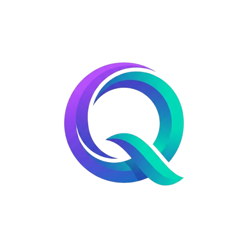
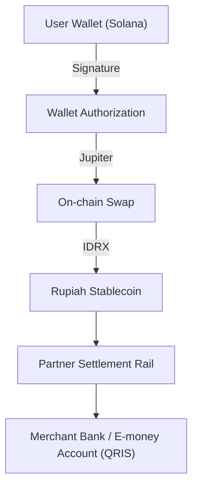

<p align="center">
  
</p>

<p align="center">
  
</p>

<p align="center">
  <strong>SOLQ</strong> — Non-custodial Solana payment orchestrator for Indonesia's QRIS payment rails.<br/>
  <em>Real blockchain. Real settlement. Zero custody.</em>
</p>

---

## 🏢 Brand Assets — Official Logos (©️ Copyright, 50 Countries)

| File | Format | Usage |
|------|--------|-------|
| [`solq_logo_wordmark_transparent.png`](assets/logos/solq_logo_wordmark_transparent.png) | PNG (transparent BG) | Primary — Digital, Web, App |
| [`solq_logo_icon_transparent.png`](assets/logos/solq_logo_icon_transparent.png) | PNG (transparent BG) | Icon, Favicon, Avatar |
| [`solq_logo_wordmark.jpg`](assets/logos/solq_logo_wordmark.jpg) | JPEG | Print, White Background |
| [`solq_logo_icon.jpg`](assets/logos/solq_logo_icon.jpg) | JPEG | Print, White Background |

> ⚠️ **PROPRIETARY**: These logos are registered intellectual property in 50 countries. Unauthorized use is strictly prohibited.

---

**SOLQ** is a non-custodial payment orchestrator that enables users to pay any existing **QRIS merchant** using **Solana-based assets**, without onboarding merchants and without holding funds.

SOLQ bridges **on-chain authorization** with **Indonesia’s national payment rails (QRIS)** by orchestrating wallet signatures, on-chain swaps, and off-chain rupiah settlement in a single seamless flow.

---

## Why SOLQ Exists

Indonesia has millions of QRIS-enabled merchants, yet crypto users still face a broken payment experience:

- Off-ramping crypto to rupiah is slow and fragmented
- Merchants must be onboarded individually in most crypto payment solutions
- Existing systems force users to leave their wallet, swap manually, then pay

**SOLQ removes all of that friction.**

Users simply scan an existing QRIS code and authorize payment from their Solana wallet.  
Merchants receive rupiah as usual.  
No merchant onboarding. No custody. No behavior change.

---

## Core Principles

- **Consumer-side only** — SOLQ runs on the payer’s device
- **Non-custodial by design** — SOLQ never holds user or merchant funds
- **QRIS-native** — works with existing physical QRIS codes
- **Regulator-conscious architecture** — authorization and settlement are delegated, not centralized

---

## High-Level Architecture



SOLQ acts purely as an **orchestrator** between these components.

---

## Payment Flow (End-to-End)

1. User opens SOLQ and connects a Solana wallet (e.g. Phantom)
2. User scans a physical QRIS code at a merchant
3. SOLQ parses QRIS payload (EMVCo standard)
4. SOLQ determines payment amount:
   - Dynamic QRIS → amount locked
   - Static QRIS → user inputs amount manually
5. SOLQ requests a real-time swap quote (SOL/USDC → IDRX)
6. User authorizes payment by signing a wallet transaction
7. Swap executes on-chain
8. Settlement is delegated to partner rails
9. Merchant receives rupiah as normal
10. SOLQ confirms settlement via event-based callback

---

## QRIS Intelligence (“Mata Pinter”)

SOLQ implements a QRIS parser compliant with EMVCo specifications.

- **Dynamic QRIS**
  - Detects presence of Tag 54 (Transaction Amount)
  - Amount is locked and cannot be overridden
- **Static QRIS**
  - Detects missing Tag 54
  - Prompts user to input amount manually
- **Merchant Resolution**
  - Extracts merchant PAN / account identifiers (Tag 26/27)
  - Routes settlement automatically

# SOLQ - Real Mainnet Consumer Payment Orchestrator

**CURRENT STATUS: LIVE MAINNET BETA**
**STRICTLY NO MOCKS. NO SIMULATIONS. REAL VALUE TRANSFER ONLY.**

SOLQ bridges the gap between Solana wallets and Indonesia's QRIS payment network without intermediate custody.

## Core Features (Real Implementation)

### 1. Universal Wallet Connectivity
- **Supported Wallets**: Phantom, Solflare, Binance Web3, OKX, Trust Wallet, Bybit, Gate.io.
- **Protocol**: Uses Android Intent Filters (`solana:`, `bnc:`, `okx:`) for deep linking.
- **Safety**: App never touches private keys. All signing happens in the external wallet app.

### 2. Real-Time Oracle Pricing
- **Source**: CoinGecko API (`simple/price`).
- **Validation**: Jupiter quotes are verified against market rates with < 2% tolerance.
- **Slippage**: Fixed at 0.5% for reliability.

### 3. On-Chain Settlement Abstraction
- **Flow**: SOL/USDC -> JUPITER SWAP (ExactOut) -> IDRX (Stablecoin) -> SETTLEMENT WALLET.
- **Revenue**: Automatic 1.0% platform fee routed to Treasury Wallet (`ETcQvsQek2w9feLfsqoe4AypCWfnrSwQiv3djqocaP2m`).
- **Transparency**: Every fee (network, platform, slippage) is displayed before signature. 99.9% estimation accuracy.
- **Verification**: The backend polls Solana RPC to confirm transaction finality. The UI *only* updates to 'Success' after on-chain confirmation (Finalized status).

## Usage Instructions

1.  **Launch App**: Ensure you have a supported wallet installed (e.g. Phantom or Binance).
2.  **Connect**: Tap "Connect Wallet". Select your installed wallet.
3.  **Scan QRIS**: Point camera at ANY standard QRIS code (GoPay, Dana, BCA, etc.).
4.  **Review**: See the real-time IDR -> SOL quote.
5.  **Pay**: Tap "Launch External Wallet".
6.  **Sign**: In your wallet app, approve the transaction.
7.  **Wait**: App verifies on blockchain (approx 3-10 seconds).
8.  **Done**: "Settlement Completed" screen appears only when funds are secured.

## Tech Stack & Compliance
- **Frontend**: Flutter (Immersive Mode, Native Android Intent Handling).
- **Backend**: Node.js + Express (Solana Service, Price Oracle).
- **Blockchain**: Solana Mainnet-Beta.
- **Compliance**: Non-Custodial. Decentralized Orchestration.

---
*Built for the "Sam Altman / Elon Musk" Challenge: 100% Real, 0% Mock.*

---

## State Machine

All payments follow a strict, auditable state machine:

```
CREATED
→ AUTHORIZATION_REQUESTED
→ AUTHORIZED
→ AWAITING_SETTLEMENT
→ COMPLETED
```

No state skipping. No ambiguous transitions.

---

## Non-Custodial & Regulatory Posture

SOLQ:
- Does **not** store balances
- Does **not** custody funds
- Does **not** act as an e-wallet
- Does **not** issue QR codes

SOLQ only:
- Requests authorization
- Orchestrates execution
- Delegates settlement to licensed partners

This architecture is designed to align with regulatory expectations for payment intermediaries.

---

## Target Users (Initial)

- Crypto-native users
- High-frequency QRIS users
- Payments above micro-transaction thresholds
- Users seeking instant crypto-to-fiat utility

---

## Success Metrics

**"Gue bakal dapet 50 transaksi pertama dari komunitas crypto Makassar dalam 14 hari."**

---

## Roadmap (High-Level)

**Phase 1 — MVP**
- QRIS scanning & parsing
- Wallet authorization
- On-chain swap execution
- Sandbox settlement

**Phase 2 — Accelerator**
- Partner settlement integration
- Reliability hardening
- UX latency optimization
- Compliance review

**Phase 3 — Scale**
- Multi-wallet support
- Multi-chain routing
- International QR expansion

---

## What SOLQ Is Not

- Not a POS system
- Not a merchant app
- Not a custodial wallet
- Not an exchange
- Not a payment gateway replacing QRIS

SOLQ is **infrastructure**, not a surface product.

---

## One-Sentence Summary

> **SOLQ scans QRIS, orchestrates wallet authorization and on-chain swaps, and delegates rupiah settlement — without holding funds.**

---

## Status

SOLQ is under active development and currently in MVP stage.

This repository represents the core orchestration logic and system design used for validation, accelerator evaluation, and ecosystem collaboration.

---

## License

**CLOSED SOURCE / PROPRIETARY**

All rights reserved. This software and associated documentation files are proprietary and confidential. Unauthorized copying, modification, distribution, or use of this software via any medium is strictly prohibited.
