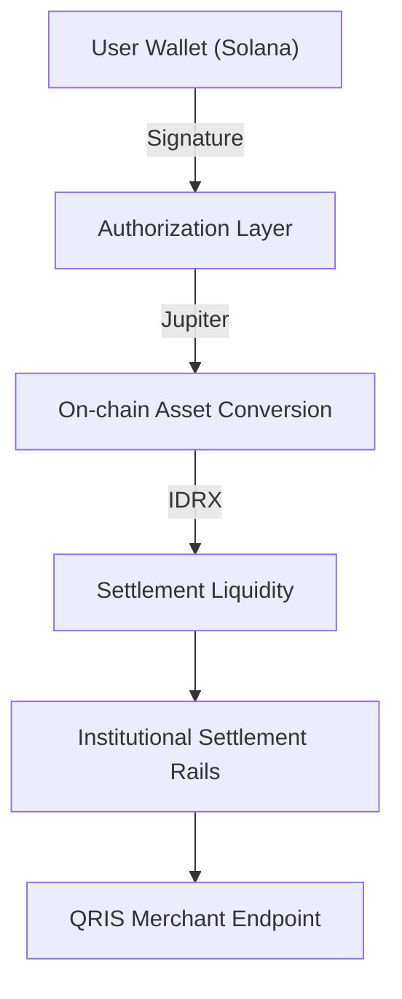
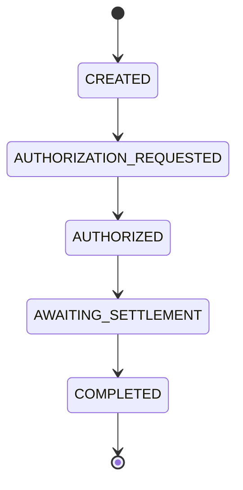

  

  

  <strong>Website:</strong> <a href="https://solq.id">solq.id</a> | <strong>Status:</strong> Controlled Mainnet-Beta

---

## 🏢 Brand Assets

Standardized brand assets for the SOLQ ecosystem.

| Version | Format | Usage |
|------|--------|-------|
| [**Wordmark (Transparent)**](assets/logos/solq_logo_wordmark_transparent.png) | PNG | Digital, Web, App Header |
| [**Icon (Transparent)**](assets/logos/solq_logo_icon_transparent.png) | PNG | Favicons, Avatars |
| [**Wordmark (Standard)**](assets/logos/solq_logo_wordmark.jpg) | JPEG | Print, PDF, Standard Backgrounds |
| [**Icon (Standard)**](assets/logos/solq_logo_icon.jpg) | JPEG | Print, Branding Collateral |

> 🔒 **Proprietary Notice**: These assets are registered intellectual property of SOLQ Technologies. Unauthorized use is prohibited.

---

# SOLQ — Institutional Payment Orchestration

SOLQ is a non-custodial orchestration layer designed to bridge high-velocity Solana assets with national payment rails (QRIS). By decoupling transaction authorization from fiat settlement, SOLQ enables seamless real-world utility without centralized custody.

---

## 🏗 High-Level Architecture

SOLQ operates as the technical bridge between decentralized authorization and regulated settlement.

---

## 🔄 Transaction Lifecycle

1. **Intent Authorization**: User signs a transaction via a supported Solana wallet (Phantom, Solflare, etc.).
2. **On-Chain Execution**: Conversion to stable assets via decentralized liquidity aggregators.
3. **Settlement Routing**: Automated instruction to designated settlement partners.
4. **Finality Verification**: RPC-based polling confirms transaction finalization on the Solana Mainnet.

---

## 🔒 Transaction State Machine

The system enforces a deterministic lifecycle to ensure auditability:

---

## System Pillars

### 1. Non-Custodial Security
- Zero-access architecture: The system never touches private keys.
- Authorization is delegated to external wallet providers via standard intent protocols.
- Deterministic on-chain verification of every protocol event.

### 2. Infrastructure Engineering
- **ExactOut Execution**: Minimizes slippage and ensures exact IDR settlement values.
- **Mainnet Finality Polling**: System status only transitions to 'Completed' upon verified RPC finalization.
- **Oracle Integrity**: Price discovery via diversified data feeds with hard-fail protection logic.

### 3. Regulatory Alignment
- **Separation of Concerns**: Authorization (On-Chain) is decoupled from Settlement (Off-Chain).
- **Compliance Delegation**: Fiat movement is handled by licensed and regulated financial infrastructure partners.
- **Auditability**: Every transaction maintains a cryptographically verifiable trail on the Solana blockchain.

---

## 🏢 Repository Scope & IP

This public repository contains selected interface components and orchestration logic. The core routing engine and internal settlement infrastructure are maintained as proprietary modules.

- **Status**: Controlled Mainnet-Beta.
- **License**: Closed Source / Proprietary.
- **IP Protection**: All rights reserved by SOLQ Technologies.

---

## 📈 Phase 1 Roadmap

- **Current Goal**: 50+ verified institutional-grade settlements to confirm structural stability.
- **Next Phase**: Expansion of partner settlement rails and cross-border QR interoperability.

---

## About

SOLQ enables instant QRIS utility for Solana users through a high-performance orchestration framework that prioritizes reliability, compliance, and non-custodial integrity.
